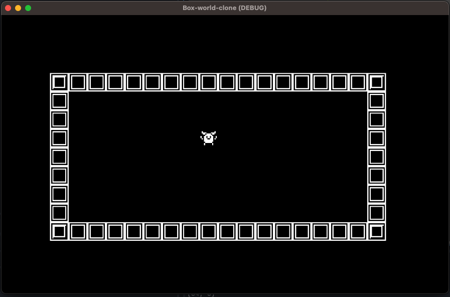

# 📦 Pusholo (a box-world-clone)

**Pusholo** - A mini clone of the Box World DOS game. Includes the first 10 levels.

Made using [Godot](https://godotengine.org/) as a game development learning exercise.

Art assets by [Kenney](https://kenney.nl/assets/1-bit-platformer-pack) - many thanks! 🙏

Original Box World Description:
> BoxWorld is a puzzle classic game among Sokoban programs, where the player has to place boxes over special places in order to gain energy to teleport to the next level.

### Original

### My Clone
